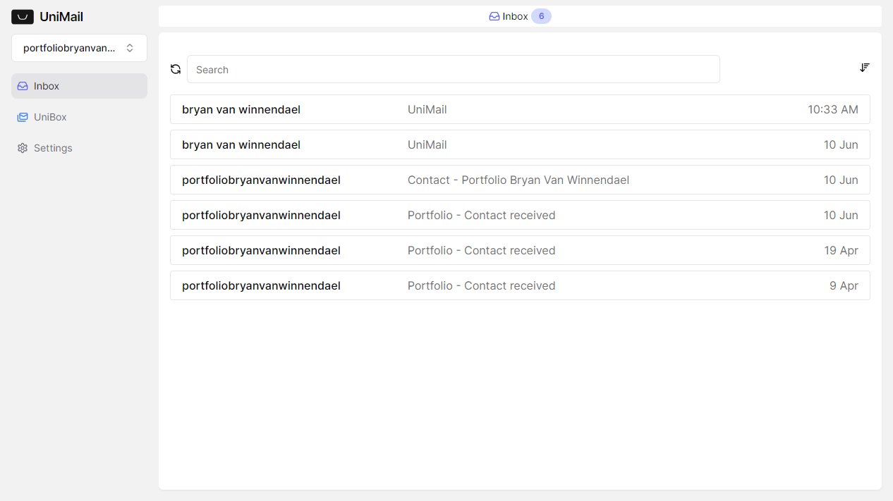
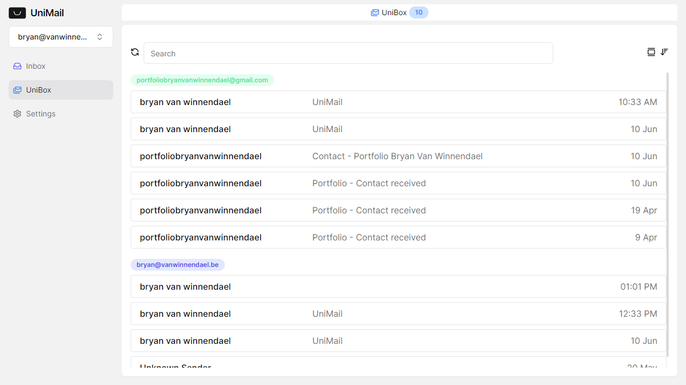
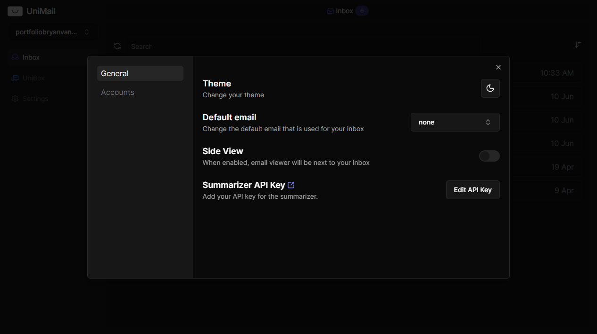

# UniMail

[Visit UniMail](https://unimail.vercel.app/)

UniMail is a web application that consolidates multiple email accounts into a single interface, allowing users to log in and manage all their emails in one place. The app offers features such as full-screen email viewing, theme customization, and adjustable email views. Additionally, UniMail integrates Groq AI to provide email summarization, enhancing the user experience by quickly condensing email content for easier reading.

Features:
- mange all emails in one place
- view emails
- summarize emails with Groq AI
- view emails full screen
- dark mode
- adjustable email views

